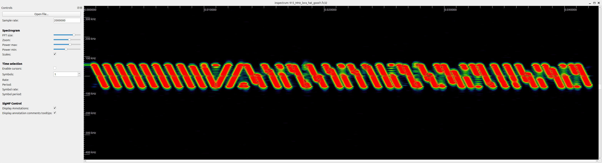
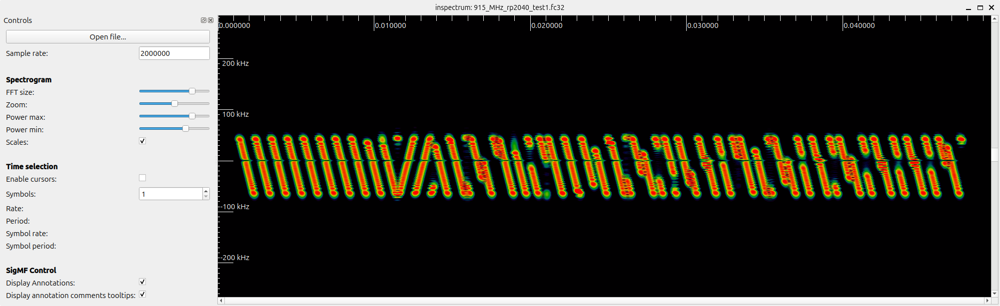
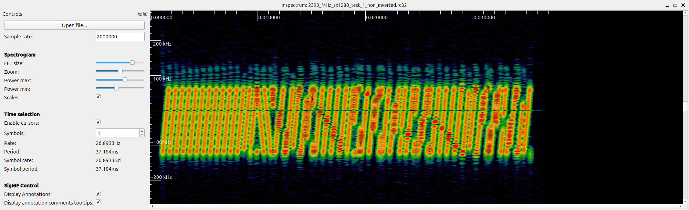
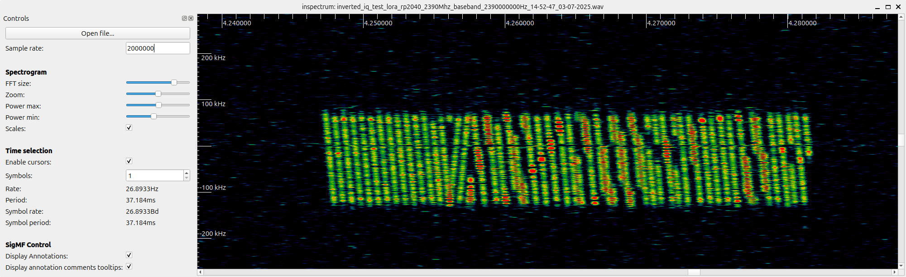
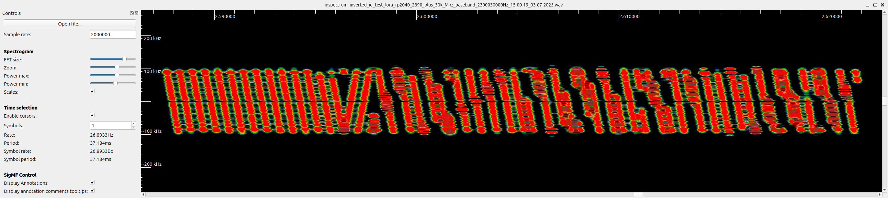
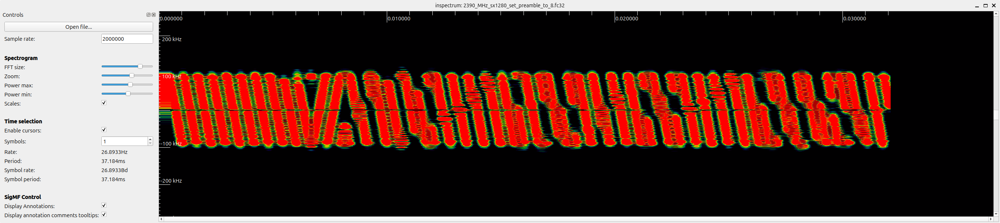

# SX1280 Debugging and Configuration Saga

This document tracks all changes, experiments, and learnings related to getting the SX1280 radio working with our s-band_transceiver_payload project. We're all students working together to solve these challenges, documenting as much as possible for future reference.

## Key Areas We Tested and Tweaked

- **SPI wiring and MISO/MOSI directions**
    - Initially had MOSI and MISO swapped; fixed wiring allowed register reads like RegVersion = 0x12 to succeed.

- **Sleep vs. standby operation modes**
    - SX1280 required correct sleep/standby transitions before any register writes could take effect, including sync word writes.

- **Bandwidth settings (e.g. 200kHz, 400kHz) and their register codes**
    - Started with 200 kHz (0x34). Verified mappings:
        - 0x0A → 1600 kHz
        - 0x18 → 800 kHz
        - 0x26 → 400 kHz
        - 0x34 → 200 kHz

- **Spreading factor codes (e.g. LORA_SF7 = 0x70)**
    - Verified defines in SX1280.h and tested with SF7 (0x70) to match working flows from RFM9x.

- **Coding rates and register values**
    - Tested CR 4/5 initially (0x01).

- **Sync word settings**
    - Default SX1280 sync word: 0x1424.
    - Added code:
        ```c
        uint8_t sw[2] = { 0x00, 0x12 };
        WriteRegisters(0x0740, sw, 2);
        ```
      to switch to 0x0012 to match our RFM9x test setups.
    - Verified writes by reading back registers 0x09C0 and 0x09C1.

- **Preamble length differences**
    - Noticed SX1280 defaulting to ~14 chirps instead of 8 like RFM9x. Plan to adjust preamble settings for shorter sync acquisition.

- **Inverting IQ polarity to match waterfall chirp direction**
    - Early captures showed diagonals sloping opposite directions. Corrected with IQ inversion register writes.

- **Matching payload length (payload_size)**
    - Matched payload size to 64 bytes initially, same as working RFM9x tests.

- **Integration with CAN bus commands to configure the radio**
    - Added SpaceCAN protocol frames to allow configuration of:
        - Frequency
        - Power
        - Bandwidth
        - Spreading Factor
        - Coding Rate
    - Example log:
        ```
        [QUEUE] Received radio message type 0
        [RADIO] CONFIGURE message received.
        [LORA_CFG] Setting frequency: 2390000000 Hz
        [LORA_CFG] Setting power: 10 dBm
        [LORA_CFG] Setting modulation: 0x01
        [LORA_CFG] Setting bandwidth (reg code): 0x34
        [LORA_CFG] Setting spreading factor (reg code): 0x70
        [LORA_CFG] Setting coding rate (reg code): 0x01
        ```

- **RadioHead header bytes (0xFF, 0xFF, 0x00, 0x00) prepended to payloads**
    - Verified that the RFM9x Python code uses this header by default, causing a fixed 4-byte overhead.

- **Testing on different frequencies (e.g. 2.39 GHz vs. 2.4 GHz) to avoid interference**
    - Found 2.39 GHz to be less noisy during lab testing.

- **SDR capture and inspectrum analysis**
    - Used inspectrum to confirm chirp slopes and timing.
    - Observations:
        - Early SX1280 captures showed inverted chirps.
        - After fixing inversion, observed ~30 kHz frequency offset.
        - Corrected preamble still longer than expected.

## Test Progress Snapshots

- **Known good capture with 915 MHz RFM9x (RPi Zero)**

    

- **RFM9x running on RP2040 with FreeRTOS**

    

- **SX1280 initial test (non-inverted chirps)**

    

- **SX1280 inverted chirps, but ~30 kHz offset**

    

- **SX1280 shifted up 30 kHz**

    

- **SX1280 corrected inversion, shifted up 30 kHz, long preamble**

    

## Next Steps

- Fine-tune preamble length to match RFM9x.
- Verify sync word changes translate to visible differences in the chirp structure.
- Adjust any remaining frequency offset (~30 kHz) seen in captures.
- Try matching payloads from SX1280 with gr-lora_sdr flowgraph for successful demodulation.

*This document is a work in progress. All students are welcome to keep adding logs, screenshots, or test notes as we push toward getting SX1280 decoding successfully.*