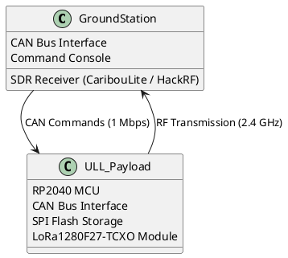
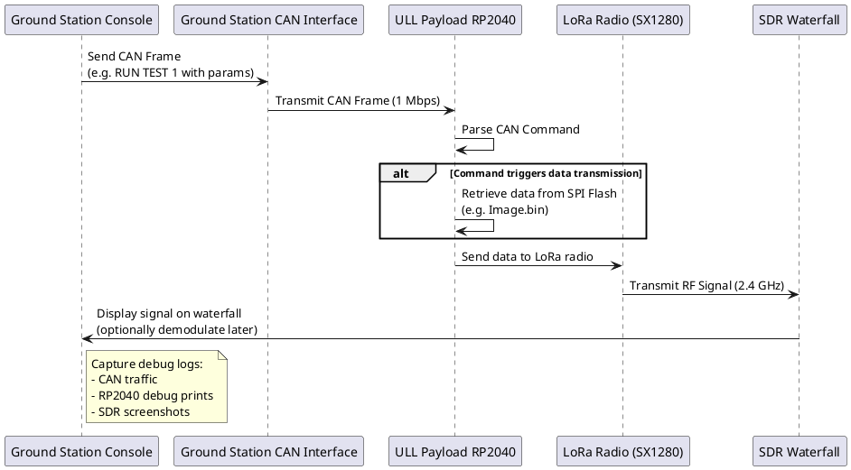

# ULL S-Band Payload Testing Document

**Version:** Draft 1  
**Date:** 2025-07-02  
**Author:** [Your Name]  
**Project:** ULL S-Band Payload

---

## 1. Purpose

This document defines the testing plan for the **ULL S-Band Payload** communications pipeline:

- **CAN commands** from a simulated “satellite” (ULL module)
- Processing and action on an RP2040 with LoRa radio (NiceRF LoRa1280F27-TCXO, SX1280)
- Transmission over 2.4 GHz band
- Observation and analysis of signals on SDRs (CaribouLite and HackRF One)

Our goal is to:

- Validate CAN communication between RP2040 nodes
- Validate the LoRa radio transmission in various modes (LoRa, FLRC, GFSK)
- Observe signals on the SDR waterfall
- Eventually decode transmissions with GNU Radio

---

## 2. Logical Architecture

Below is a PlantUML block diagram showing the logical architecture of the test setup.

---

## 3. Detailed Message Sequence

Here’s a PlantUML sequence diagram showing the test procedure for any transmission scenario (Hello, image, telemetry):

---

## 4. Hardware & Tools

| Component | Details |
|-----------|---------|
| **MCUs** | RP2040 on both modules |
| **LoRa Module** | NiceRF LoRa1280F27-TCXO (Semtech SX1280) |
| **CAN Bus** | 1 Mbps |
| **SDRs** | CaribouLite Hat (primary), HackRF One (secondary) |
| **Test PC** | Linux with GQRX, GNU Radio for future demodulation |

---

## 5. Test Scenarios

Below are the test scenarios to execute.

---

### 5.1 Transmit “Hello” String

- **Purpose:** Validate end-to-end communication for minimal payload
- Data: “Hello”
- Command: CAN frame instructing RP2040 payload to transmit Hello
- Tests:
  - Vary TX power levels
  - Test different center frequencies (e.g. 2.400, 2.405, 2.410 GHz)
  - Try different modulation modes:
    - LoRa
    - FLRC (if possible)
    - GFSK (if possible)
  - Vary bandwidth (e.g. 203 kHz, 406 kHz, 812 kHz, 1.6 MHz)
- Logs to capture:
  - CAN message debug prints
  - RP2040 debug prints
  - SDR waterfall screenshots

---

### 5.2 Transmit 2 MB Image File

- **Purpose:** Stress test higher data volume
- Data: 2 MB file stored in SPI Flash
- Command: CAN command with image filename / index
- Tests:
  - As above:
    - Power levels
    - Frequencies
    - Modulation schemes
    - Bandwidths
- Logs:
  - CAN messages
  - RP2040 debug logs
  - SDR screenshots
  - Timing measurements:
    - Total transmission time
    - Packet sizes

---

### 5.3 Transmit Telemetry Data

- **Purpose:** Simulate real payload telemetry scenario
- Data: Example telemetry JSON string or CSV format
- Command: CAN command triggering telemetry transmission
- Tests:
  - Same test matrix:
    - Power
    - Frequency
    - Modulation
    - Bandwidth
- Logs:
  - CAN messages
  - RP2040 debug logs
  - SDR screenshots

---

## 6. Test Parameter Matrix

The following matrix defines parameters to vary during testing.

| Parameter | Values |
|-----------|--------|
| **Transmit Power** | Min to Max supported by module (document each value used) |
| **Frequency** | e.g. 2.400 GHz, 2.405 GHz, 2.410 GHz |
| **Modulation** | LoRa, FLRC, GFSK |
| **Bandwidth** | e.g. 203 kHz, 406 kHz, 812 kHz, 1.6 MHz |
| **Spreading Factor (if LoRa)** | SF5 – SF12 |
| **Coding Rate** | 4/5, 4/6, etc. |

---

## 7. Debug Logging Plan

During every test, capture:

✅ CAN Bus messages  
✅ RP2040 debug print logs (plain text)  
✅ SDR screenshots from GQRX or other tools  
✅ Notes on visible signal quality:
   - Signal strength (RSSI)
   - SNR (if measurable)
   - Waterfall clarity
✅ Transmission timing measurements (if applicable)

---

## 8. Pass/Fail Criteria

A test is **PASS** if:

- The RP2040 receives and correctly parses the CAN command
- The LoRa radio transmits data
- The SDR waterfall shows an RF signal at the expected frequency and bandwidth

---

## 9. Future Work

- Integrate GNU Radio demodulation
- Verify actual bit error rates
- Automate SDR capture and signal analysis
- Outdoor range testing

---

## 10. Document Artifacts

Save the following artifacts for documentation and presentations:

- PlantUML diagrams
- Test logs
- SDR screenshots
- Timing measurements
- Notes on issues encountered

---

**End of Document**